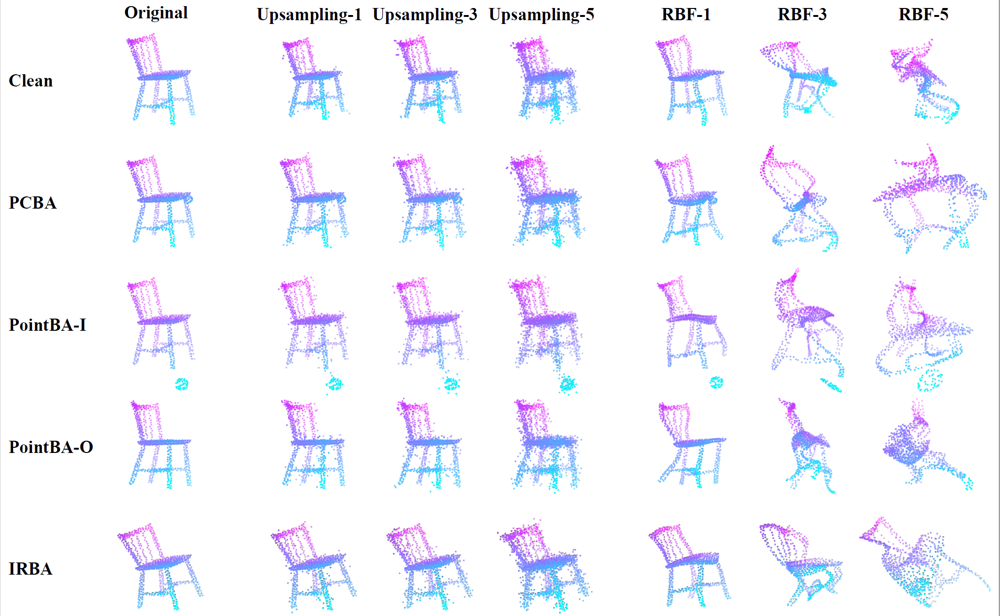

# PointCRT

The implementation of our ACM MM 2023 paper "PointCRT: Detecting Backdoor in 3D Point Cloud via Corruption Robustness "[[paper](https://doi.org/10.1145/3581783.3612456)]




## Requirements
- torch==1.13.0
- xgboost
- scikit-learn
- open3d

## Getting Started

- **Clone this Code Repository**

```shell
git clone https://github.com/CGCL-codes/PointCRT.git
cd PointCRT
```

- **Build Third-party modules  `Pygem`**

Some corruption methods in [ModelNet40-C](https://github.com/jiachens/ModelNet40-C) require it. More installation details could be found [here](https://github.com/mathLab/PyGeM).

```shell
git clone https://github.com/mathLab/PyGeM.git
python setup.py install
```

- **Update the file path of the datasets in `config.yaml`**

```yaml
ModelNet_path: 		'/Path/to/ModelNet/'
ShapeNetPart_path: 	'/Path/to/shapenet/'
```

## Quick start

**Generate backdoor sample**

Similar approaches can be considered for other backdoor attack methods. However, it should be noted that `SC`` is optional. This is due to the requirement in the PCBA algorithm.

```shell
python PCBA.py --target_model pointnet_cls --dataset ModleNet40 --SC 8 --TC 35
```

  - attack_dir: /path/to/backdoor/sample
  - SC: index of source class 
  - TC index of target class

**Train a Backdoor Model**

```shell
python train_attacked.py --target_model pointnet_cls--dataset ModleNet40 --attack_dir attack --output_dir model_attacked
```
  
  - attack_dir: /path/to/backdoor/sample
  - output_dir: /path/to/results

**Detection the Backdoor sample**

```shell
sh script/Process.sh
python PointCRT.py --result_dir model_attacked --target_model pointnet_cls --dataset ModelNet40
```

You can also customize above procedure by modifying the configuration of `Process.sh`

## Evaluate the clean models

If you want to evaluate the accuracy of the clean models, you can utilize the following pre-trained models for evaluation. The Google Drive link is [here](https://drive.google.com/file/d/1L25i0l6L_b1Vw504WQR8-Z0oh2FJA0G9/view?usp=sharing). 

The pre-trained models are provided by [SI-Adv](https://github.com/shikiw/SI-Adv). The available models include [PointNet](https://github.com/charlesq34/pointnet), [PointNet++](https://github.com/charlesq34/pointnet2), [DGCNN](https://github.com/WangYueFt/dgcnn), [PointCNN](https://github.com/yangyanli/PointCNN), [PointConv](https://github.com/DylanWusee/pointconv_pytorch), [RS-CNN](https://github.com/Yochengliu/Relation-Shape-CNN),  [PCT](https://github.com/Strawberry-Eat-Mango/PCT_Pytorch), [SimpleView](https://github.com/princeton-vl/SimpleView) and [CurveNet](https://github.com/tiangexiang/CurveNet).

## BibTex

```bibtex
@inproceedings{hu2023pointcrt,
  author = {Hu, Shengshan and Liu, Wei and Li, Minghui and Zhang, Yechao and Liu, Xiaogeng and Wang, Xianlong and Zhang, Leo Yu and Hou, Junhui},
  title = {PointCRT: Detecting Backdoor in 3D Point Cloud via Corruption Robustness},
  doi = {10.1145/3581783.3612456},
  booktitle = {Proceedings of the 31st ACM International Conference on Multimedia},
  year = {2023}
}
```

## Reference
This codebase is based on [PCBA](https://github.com/zhenxianglance/PCBA), and the corruption methods are based on [ModelNet40-C](https://github.com/jiachens/ModelNet40-C).